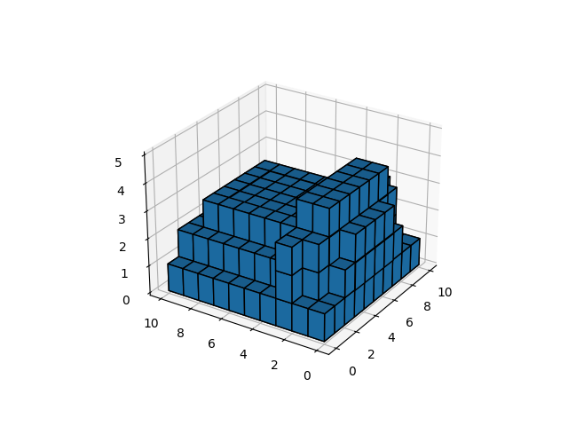
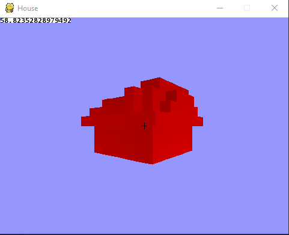
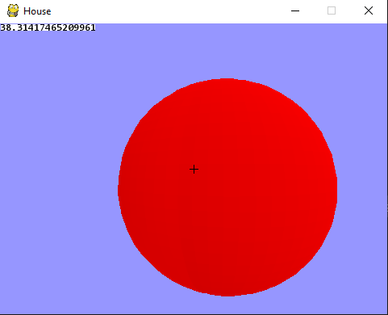
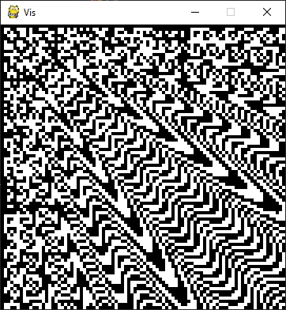

# small-projects
Random small projects I've done.

## evolved_houses (Mar 2021)
A genetic algorithm to evolve houses evaluating on weather, economic, and cultural factors. The home can be graphed in matplotlib or my custom 3D renderer.

I was inspired by the idea of a game where you're in a town the culture and conditions of the town are procedurally generated.

Evaluation parameters include:
- sun protection
- water protection
- x/z symmetry
- resource availability
- material sweetspot
- height

`home.py` contains the main genetic algorithm, with generic functions for culling, evaluating, mutating, and crossing over.
`render_house.py` contains a 3D graphics engine built on top of pygame. It renders polygons with basic normal lighting.

A roof for a house that favors symmetry on x and asymmetry on z, sun protection is necessary, and there's a material constraint.

A sphere and part of a car rendered in the 3D renderer.

## function_vis (Nov 2021)
Contains a skeleton for writing and visualizing functions of x, y, t in 2D.

I like visualizing functions. :) I would like to make it generate a random function, one day with time and inspiration.

