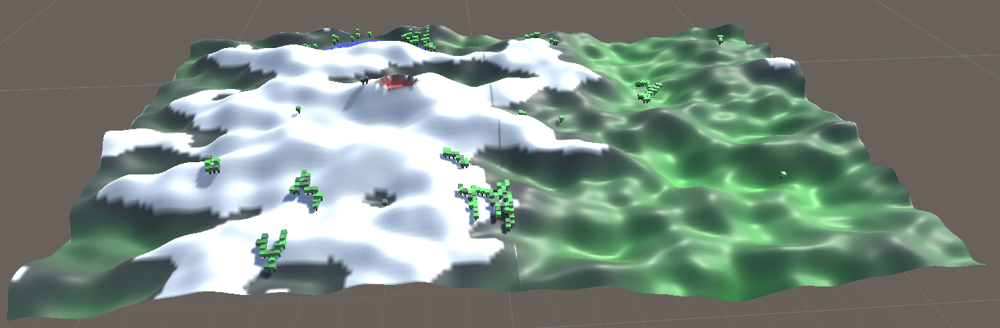
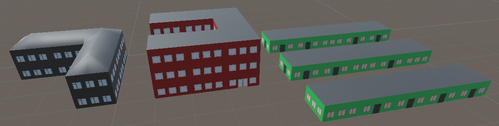
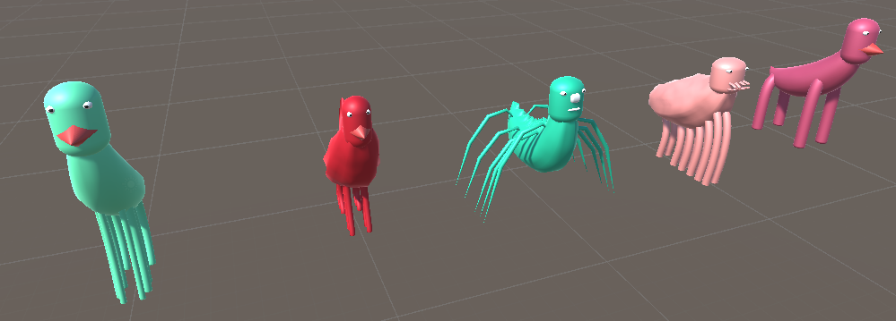
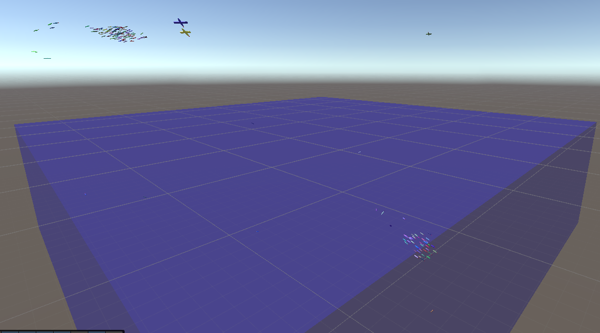
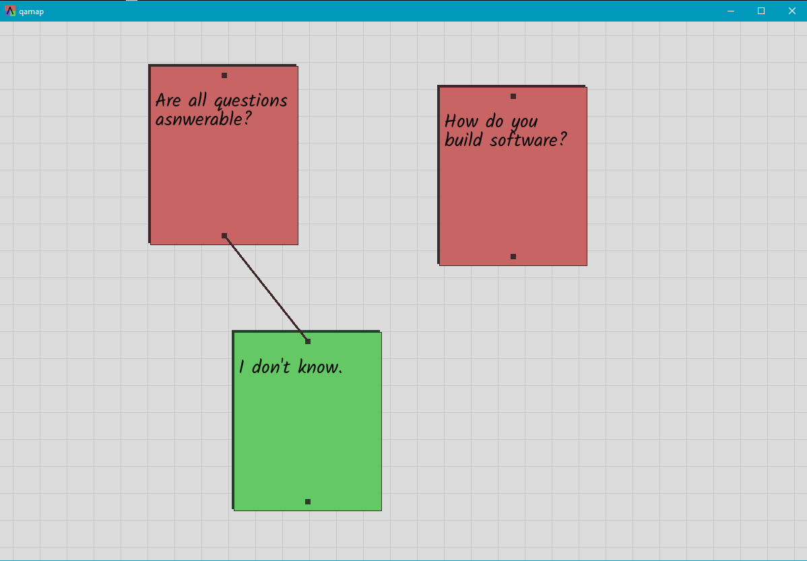
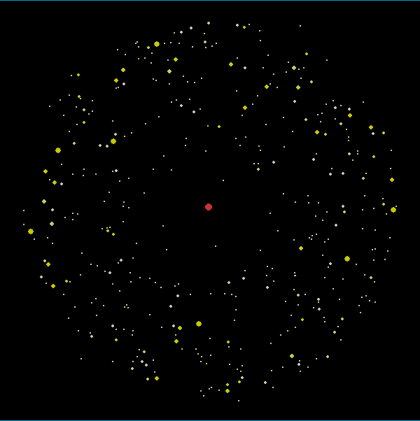

# small-projects
Random small projects I've done.

## PCG class projects (Spring 2018)
I took a procedural content generation class my second year in college. We used Unity and I built:
- World generation with infinite scrolling using Perlin noise, I included forests, lakes, snowy mountains, and volcanic craters
- Building generation
- Creature generation using bezier curves
- Flocking boids

## evolved_houses (Mar 2021)
A genetic algorithm to evolve houses evaluating on weather, economic, and cultural factors. The home can be graphed in matplotlib or my custom 3D renderer.

I was inspired by the idea of a game where you're in a town the culture and conditions of the town are procedurally generated.

Evaluation parameters include:
- sun protection
- water protection
- x/z symmetry
- resource availability
- material sweetspot
- height

`home.py` contains the main genetic algorithm, with generic functions for culling, evaluating, mutating, and crossing over.
`render_house.py` contains a 3D graphics engine built on top of pygame. It renders polygons with basic normal lighting.

A roof for a house that favors symmetry on x and asymmetry on z, sun protection is necessary, and there's a material constraint.

A sphere and part of a car rendered in the 3D renderer.

## function_vis (Nov 2021)
Contains a skeleton for writing and visualizing functions of x, y, t in 2D.

I like visualizing functions. :) I would like to make it generate a random function, one day with time and inspiration.

## qamap (Apr 2023)
Can software be built by a graph of questions and answers?

I don't know, but this program can help you try. The idea is that you start with an overarching question, then ask clarifying questions until you have a question you can answer with a terminal leaf node. Once you've answered all your questions, you start implementing the leaf nodes.  

TODO:
- Allow creation of answers. Currently, you only get the starting answer and newly created boxes are questions.
- Make the screen scrollable.
- Expand boxes with a lot of text

Kalam font license here: https://fonts.google.com/specimen/Kalam/license

## gravity (Oct 2023)
Simple 2D Newtonian gravity sim with momentum based collisions.

The simulation is pretty slow because there are no optimizations. One easy and typical optimization for this type of sim would be to only consider force vectors for close objects, ignoring or using a coarse mass calculation for far away objects.

Controls:
- p: toggle printing object coords each frame
- a: add a new set of particles
- f: zoom and pan to fit all the particles into the window
- c: center on the sun at the current zoom
- minus: zoom out
- equals: zoom in
- left: pan left
- right: pan right
- up: pan up
- down: pan down
- escape: quit

## Kalimba (Dec 2023)
A Kalimba practice tool. You can input a tab or set `use_random` and then play the Kalimba. If your microphone is on, it'll detect the frequency of the note you played and move you to the next note once you play it. 

It doesn't currently support chords or non-C-major scales.

## debruijn (May 2025)
Find A) an image that contains all n x n images and B) the smallest image that contains all n x n images.

*nxn.py* does the A naively. I generated up to all 5x5 images, which was 20480x40960! 2.png and 3.png are for 2x2 and 3x3 respectively.

*smallestnxn_\*.png* try to create the smallest possible image that contains all n x n images using a genetic algorithm to optimize toward having more unique sub images. 5x5.png is the smallest for 2x2. 25x34.png is the smallest I found for 3x3, though an 18x34 image is the smallest possible image with enough pixels (2^4 + (3-1) x 2^5 + (3-1)). I ran smallestnxn_smart.py at this size but the best I got had only ~90% of all 3x3s... the search continues! smallestnxn_graph.py uses an Eulerian path approach, which considers options much faster since there's no image manipulation, but it didn't get particularly close either since there's so many possible images (2^(18*34)).

Later I learned this is a known problem called de Bruijn Torus. My implementations don't consider wrapping, but you could construct mine from duplicating the top and left of the torus image to the bottom and right. There are already 16x32 solutions, but I haven't dove into their construction yet: https://demonstrations.wolfram.com/TheDeBruijnTorus/. Wikipedia gives a 4x4 image too! https://en.wikipedia.org/wiki/De_Bruijn_torus.

25x34.png:

